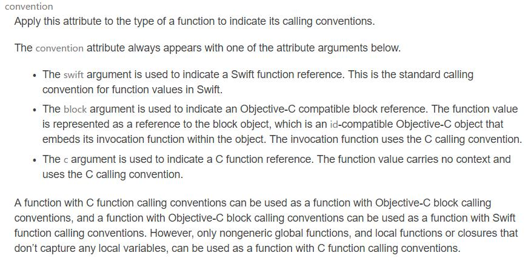

# Demo: Use a Swift function as a paramter when calling a C fuction in Swift 3.1

## Limitions

As happened with strings, Swift is able to automatically convert closure into C function pointers when used as parameters, but with a major twist, closures that will be used as a C function pointer parameter cannot capture any value outside of their context.

To enforce this, this kind of closures (and closures that are the result of a conversion from a C function pointer) are annotated automatically with a specific type attribute @convention(c) that, as described in the chapter on type attributes of Swift Language Reference, indicate the calling convention the closure will conform to. The possible value are : c, objc and swift.

https://www.uraimo.com/swift2/2016-04-07-swift-and-c-everything-you-need-to-know.html



## Compile and Test
```
gcc -c demo.c
swiftc -import-objc-header demo.h main.swift demo.o -o main
./main
```

## Using Docker
```
docker run --rm -it -v `pwd`:/code -w /code swift bash
```